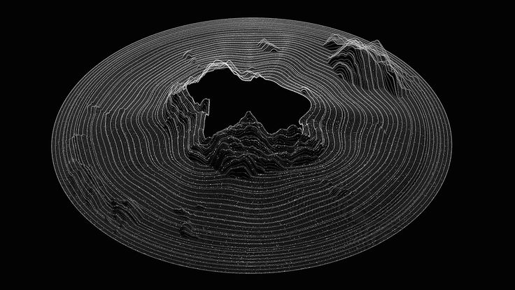
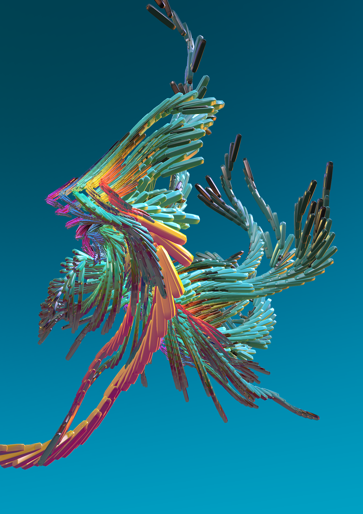

<h1>Generative Computer Graphics HS2020</h1>

##### Table of Contents
- [Week 1](#week-1)
  - [Day 1](#day-1)
  - [Day 2](#day-2)
  - [Day 3](#day-3)
- [Week 2](#week-2)
  - [Day 4](#day-4)
  - [Day 5](#day-5)
  - [Day 6](#day-6)
- [Week 3](#week-3)
  - [Day 7](#day-7)
  - [Day 8](#day-8)
  - [Day 9](#day-9)
  
### Results
  - [2D with p5](https://twistedpan.github.io/Generative_Computer_Graphics/mic_visualisation/p5_only/)
  - [3D with p5 & three](https://twistedpan.github.io/Generative_Computer_Graphics/mic_visualisation/p5_three/)
  
---
---


## Week 1:


  - ### Day 1
  
    __Idea:__
    get Mic input and create interactable sketch.

    __Problem:__
    Web technologies safety standarts.
    Web browser didn't get the input from the mic, p5 was throwing error messages, some older sketches still working the new ones didn't worked.

    __Solution:__
    Took an older sketch and copy paste the mic part, 
    wrote a intro page to get trough the chrome safety part
    ( create user input before audio can play ), 

    __Realization:__
    Mic input consists only of volume, no frequenzies possible.
    
       |  | 
      ------------ | ------------ | -------------
       | | 
      
      [Play it here](https://twistedpan.github.io/Generative_Computer_Graphics/mic_visualisation/p5_only/growingCircles.html)
    
```javascript
function setup() {

    mic = new p5.AudioIn()
    mic.start();

}
```


---

  - ### Day 2
  
    __Idea:__
    bubbles grow in size through the mic input.
    bubbbles pop if they collide.
    
    __Realization:__ That worked very well.
    
    

      
       | 
      ------------ | ------------
       | 
       
      [Play it here](https://twistedpan.github.io/Generative_Computer_Graphics/mic_visualisation/p5_only/popping.html)
 
    started to look at three.js
    
    __Idea:__ create foggy Cube grid to learn about the library

    
    
       | 
      ------------ | ------------
       | 
       
      [Play it here](https://twistedpan.github.io/Generative_Computer_Graphics/mic_visualisation/p5_three/cubeGrid.html)

    __Realization:__
    Mic input can also be analyzed with fft.

      ```javascript
      function setup() {

          mic = new p5.AudioIn()
          mic.start();

          fft = new p5.FFT();
          fft.setInput(mic);

      }
      ```

    started to work at an easy-to-implement script for others to use the microphone input.

---

  - ### Day 3
  
    Finallized the microphone input handler --> [Microphone Input Analyzer](https://github.com/twistedPan/p5_microphone_input_analyzer "GitHub Link")
    
    continued to work with three.js

    learned about materials, geometries, cameras, lights, etc.


---
---


## Week 2:


  - ### Day 4

    __Homework:__ Read more about the history of gernerative art and look for an artist, whose art you like.
    
      Bradley G Munkowitz | Marcin Ignac
      | :------------: | :------------: |
       | 
    
    
    __Idea:__ Display each of the 1024 frequencies as point on a circle and create a soundwave-like circle.
    Like the picture of Bradley G Munkowitz
    

    created a 2D sketch in p5.js 
    
    

       |  | 
      ------------ | ------------ | -------------
       | | 
       
      [Play it here](https://twistedpan.github.io/Generative_Computer_Graphics/mic_visualisation/p5_only/circleEq.html)

    To create the circles around the circles, i fill a 2-dimensional Array 
      ```javascript
      let elements = [];
      let radius = 66;

      for (let i=0; i<16; i++, radius+=66) {
          // create second dimension for Array elements
          elements[i] = [0];

          // save positions of 64 points even spaced on a cirlce with radius 'radius'
          let circleArr = pointsOnCircle(0,0,0,radius,64);

          // place elements on the current circle 
          for (let j=0; j<64; j++) {
              elements[i][j] = new Element(circleArr[j].x,circleArr[j].y,5,"circle")
          }   

      }
      ```


    then moved the whole thing to three.js

       |  | 
      ------------ | ------------ | -------------
       | | 
       
      [Play it here](https://twistedpan.github.io/Generative_Computer_Graphics/mic_visualisation/p5_three/circle3D_EQ_v1.html)


---
  
  - ### Day 5

    Switched the cubes with lines and ended up playing with it the whole day
    
       |  | 
      ------------ | ------------ | -------------
       | | 
       
      [Play here the current version](https://twistedpan.github.io/Generative_Computer_Graphics/mic_visualisation/p5_three/lines3D_EQ.html)


    deactivated the canvas refresh mode and played with the camera around. 
    
    

       |  | 
      ------------ | ------------ | -------------
       |  | 

      [Play it here](https://twistedpan.github.io/Generative_Computer_Graphics/mic_visualisation/p5_three/circle3DNoRefresh.html)

---
  
  - ### Day 6
    #### The Day after the Party

    Spend the day trying to rearrange the blocks to have a increasing amount of positions from center to end (hangover)
    Did it after 3 hours

    Calculating new positioning for cubes:

        old 16 * 64 / 64 . 64 . 64 . 64 . 64 . 64 .... 1024

        new
        n +4, +4, +8, +8, +16, ....
        8 . 12 . 16 . 24 . 32 . 48 . 64 . 96 . 128 . 192 ....	  nope

        n = n+8
        8 . 16 . 24 . 32 . 40 . 48 . 54 . 62 . 68 . 74 ....     nope

        n = n+6
        6 . 12 . 18 . 24 . 30 . 36 . 42 . 48 . 54 . 60 . . 108 = 1026   almost works
    
    
       |  | 
      ------------ | ------------ | -------------
       | | 
       
      [Play it here](https://twistedpan.github.io/Generative_Computer_Graphics/mic_visualisation/p5_three/circle3D_EQ.html)

    __Realisation__:
      Math is even harder if you've a hangover.


---
---


## Week 3:


  - ### Day 7

      __Idea:__ Expand the cube circle. 
      - More colors, maybe a gradient
      - More forms
      - More action in the background

      __Problem:__
      wrote a wrong lerpFunction
      ```javascript
      // lerps from color1 to color2
      function lerpFromTo(from, to, amt) {
          amt = clamp(amt,0,1);
          let f1 = from[0]; let f2 = from[1]; let f3 = from[2];
          let t1 = to[0]; let t2 = to[1]; let t3 = to[2];

          let r = f1 - t1 * amt;
          r = clamp(r,0,255);
          let g = f2 - t2 * amt;
          g = clamp(g,0,255);
          let b = f3 - t3 * amt;
          b = clamp(b,0,255);

          let color = [r,g,b]
          return color;
      }
      ```
      __Solution:__
      correct lerp = amt * (stop - start) + start

      __GitHub:__
      Published the gitHub repository, changed all paths and edited the index files to display every sketch
      
      __Things Done:__
      Colors are learping from inside to outside
      
       |  | 
      ------------ | ------------ | -------------
       | | 
       
      [Play it here](https://twistedpan.github.io/Generative_Computer_Graphics/mic_visualisation/p5_three/circle3D_EQ.html)

---

  - ### Day 8

      __Last Day Goals:__
      Expand the circular equalizer.
      
      Wanted to first change the light in the "grid of cubes"-script and ended up with a new sketch.
      
      
       |  | 
      ------------ | ------------ | -------------
       |  | 

      [Play it here](https://twistedpan.github.io/Generative_Computer_Graphics/mic_visualisation/p5_three/cubeUpload.html)

      After that i continued work on the circular equalizer and added movement to the camera and change the size of the cubes basis depending on the amp.
      But i removed it afterwards because the camera moved weird because of the rotation of the whole sketch.
      
      __Realisation:__
      I'm working for too long on this sketch. I've lost interest in it.

---

  - ### Day 9

    __Presentation Day__
    


